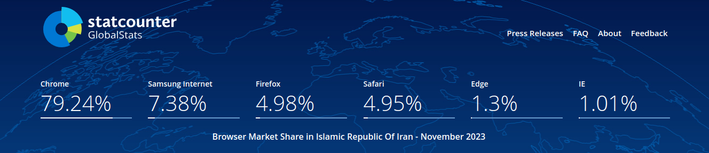

## Intro

What would be your answer if you were asked to prioritize the browsers by popularity amongst your web application's users? We all know that Chrome is the most popular, but what about the rest of the list? You might say Safari is the second most used browser based on all the iPhone users you see around you.

Chrome's dominance often misleads us. We think 85% of users use Chrome. The other 5% use Edge which is the same as Chrome. Maybe 9% are using Safari and the other 1% of users are not that important. So we cover 99% of all the users if our web application works correctly on Chrome and Safari.

So we think our end-users will either use Chrome or Safari. We forget about other users. This article will prove that often this is not the case.

## Is "Supporting Different Vendors" Still a Thing These Days?

You might have heard about the browser inconsistency in the early years of web development which was mostly solved by standardizing the implemented features in recent years. Developers used to re-write the same styles multiple times for multiple vendors so the website could be displayed correctly on these browsers.

But what about now? Aren't web browsers standard right now? Well, there are some areas where browsers might behave differently. Some of these areas are:

- Some new features are partially supported across different browsers
- Some minor rendering inconsistencies exist for even long-supported features
- Different support level for some Web APIs is a common thing

But why should we care about providing the same UX for all users? A better UX for all users means better conversion for the business. Supporting 90% of users with supporting major browsers is good but what if with some small modifications, we can add another 5% to the percentage above?

## Different Regions, Different Market Shares

"My web application works fine on Chrome, Firefox, and Safari so I'm safe." you might say. But are Chrome, Firefox, and Safari always the top three browsers that your target audience uses? In the image below you can see stats for my local browser market share that I have taken from [gs.statcounter.com](https://gs.statcounter.com).

Browser market share in Iran (Nov 2022 - Nov 2023)
You can see that Samsung Internet Browser holds the second position. I bet many developers (including me before seeing this) didn't test their web application against this browser because it went unnoticed.

These stats are different for every country, region, and worldwide. So depending on the scope of your web application you should check what browsers you should support fully. In my case for an application that is for national users, I would test for Chrome, Samsung Internet, and Safari, and maybe Firefox if it is not too much work. You should decide depending on your situation.

## Tricky In-app Browsers

Some applications like Instagram, Telegram, or Facebook open the links with an in-app browser. What is this browser? Is it Chrome? Firefox? Safari? It seems it is none of them. They might use the same engine but it is not guaranteed that it will output the same result.

You should support these browsers as well if you have a social media account that sends direct traffic to the web application a lot. You don't want your users to leave the source application's comfortable and pleasing user experience to your half-rendered glitchy web application. Your users would simply lose interest.

## Conclusion

When developing Front-end web applications keep in mind that not everyone uses the latest version of Chrome or Firefox. There might even be some projects in which half of your target users might use IE. In this case, you might probably do things differently. You might choose your stack differently and take an old-school solution.

Every project has different users. Some might have users who mainly use old versions of Chrome, and some applications might have worldwide scopes in which their users use all kinds of browsers. A wise front-end engineer should consider these factors and test their software before releasing it into the market.
